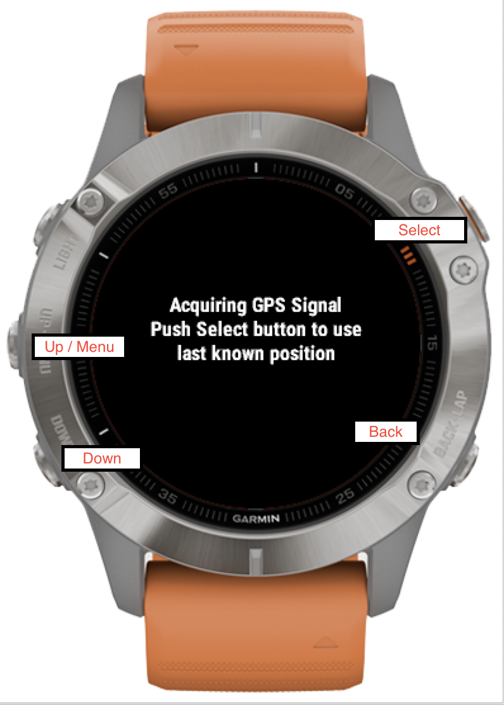
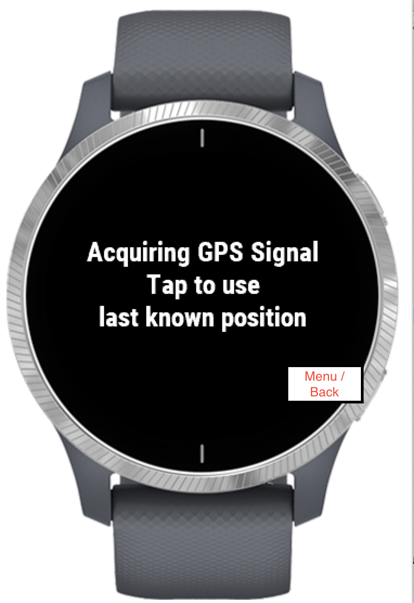
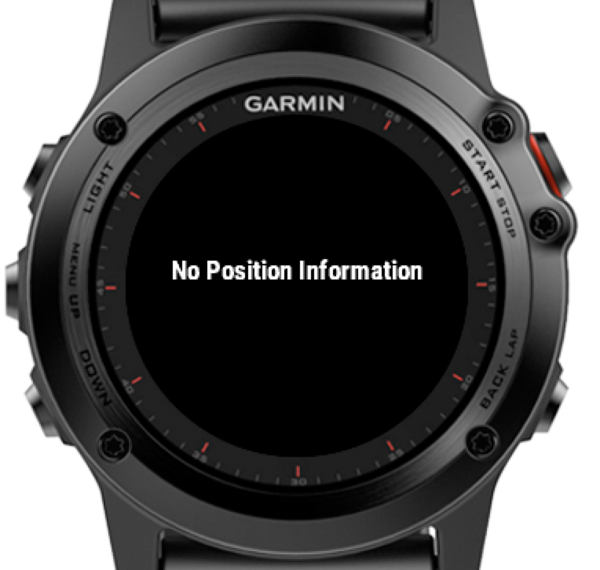
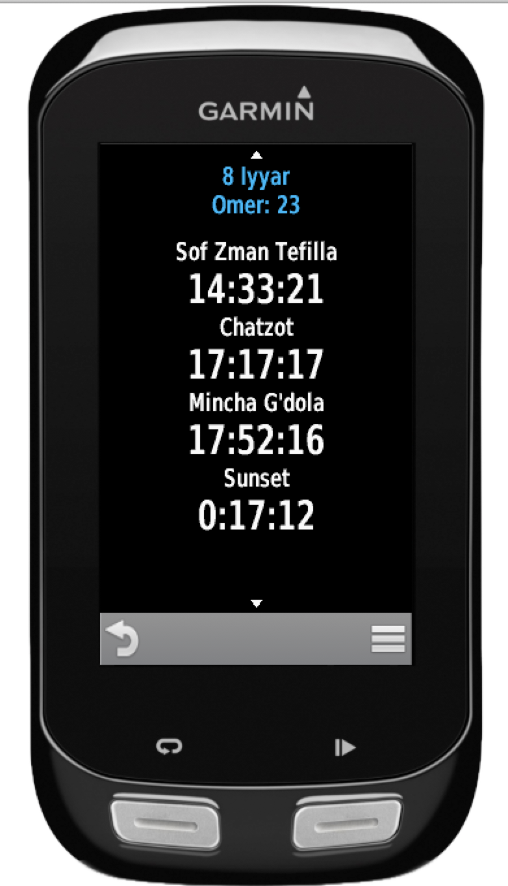
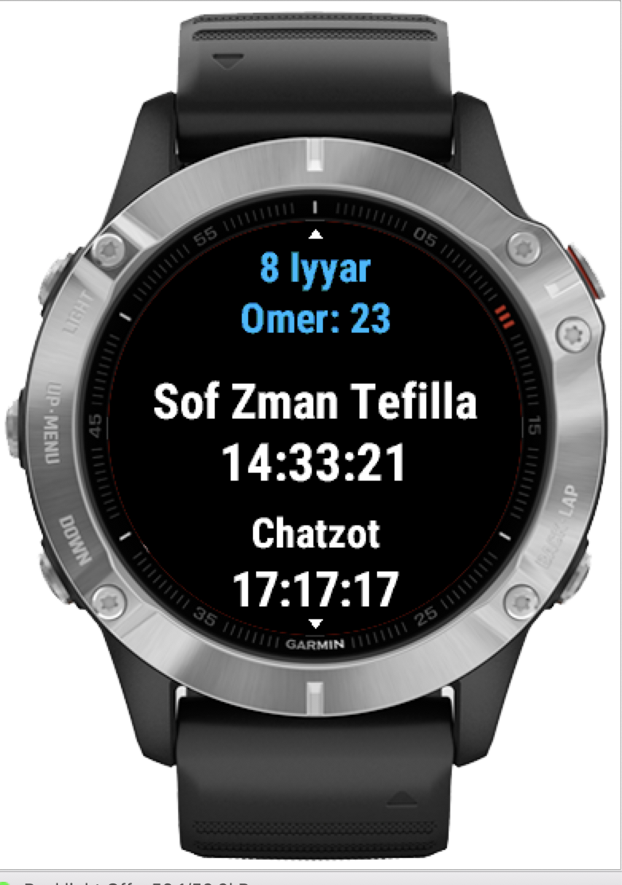
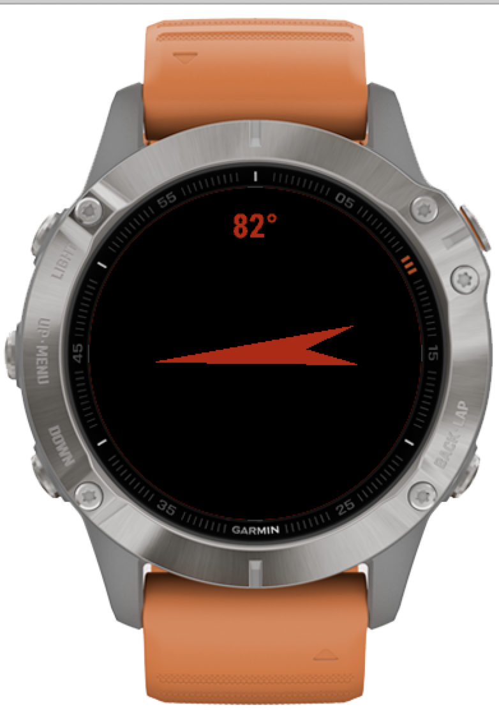

# Instructions for Jewish Prayer Times Widget for Garmin Devices

© Slipperybee

App Version 4.0.0

## Functions
- Shows the following times:
	- Dawn (Alot HaShahar)
	- Zman Talit and Tefillin
	- Sunrise
	- Sof Zman Kiryat Shma
	- Sof Zman Kiryat T'filla
	- Chatzot
	- Mincha Gedola
	- Candle Lighting
	- Sunset (Shkiya)
	- Tzeit Hacokhavimn
- Compass to Jerusalem
- Use real elevation or sea level
- Show holidays in Israel or the Diaspora
- Choose dawn/dusk method
	- Magen Avraham
- Choose Date

## General Usage
Depending on your device the "Up", "Down", "Select" and "Menu" buttons or functions are different.  This depends on whether the device is touch or how many buttons it has.  Here are some examples:

### Non-touch watch

__To access the menu the *up* button needs to be pressed and held__

### Touch Watch

__To access the menu press the *back* button and hold.  Up and down is done through swiping.  To select *tap* the screen__

### Other Devices
See your manual to see how other devices use the menu depending on touch or not.

## Functionality
### Getting position information
When you first access the widget it needs to be updated with your position.  Therefore you should start the widget outside or at least near a window that has good access to the GPS satellites.  
If you have already updated the position you can press "Select" (or tap) to load the position.  If you do this and no position has been saved the widget will display an error message:

In this case you will have to restart the widget outside

### Viewing the times
Once the widget has successfully obtained your position it will display the times.  This is displayed as a scrollable list that can be scrolled using up and down (buttons or swipe).  It will by default display the next time (either at the top for rectangular devices or in the middle for watches).

At the top of the list today's hebrew date is shown.  Below that one of the following is shown (in this order of preference):
- The day of the omer
- The current holiday
- The current year

Here the next time is at the top

Here the next time is in the middle of the scrollable list

### Compass to Jerusalem
To view the compass press the *Select* button or tap - according to your device type.  This will open the compass view.

 

The compass bearing refers to the direction of Jerusalem.  When you near the correct direction the arrow will turn green.

Press the *back* button to return to the main times list

### Menu
Press the *menu* button (depending on your device).  Using the menu depends on the type of device that you have.  There are a number of choices you can make:

## Real Elevation
Here you can choose whether the elevation is measured from the GPS position or sea-level.  This option is saved for future sessions.

## Yom Tov Sheni
Here you can choose whether to show festivals according to Israel or Chutz LaEretz.  This option is saved for future sessions.

## Dawn/Desk Method
Here you can choose whether dawn and dusk are calculated according to the Magen Avraham or the Gra. This option is saved for future sessions.

## Choose Date
Here you can adjust the date to see the times.  Please note that this is not saved for future sessions.  When you open the widget again the date will be reset to the current date.

## Help
A simple help screen

## About
Information for debugging and support purposes

### Help and contact
You can contact the developers at the facebook page:
<https://www.facebook.com/jewishprayertimesconnectiq/>

or by email at <contact@slipperybee.com>
